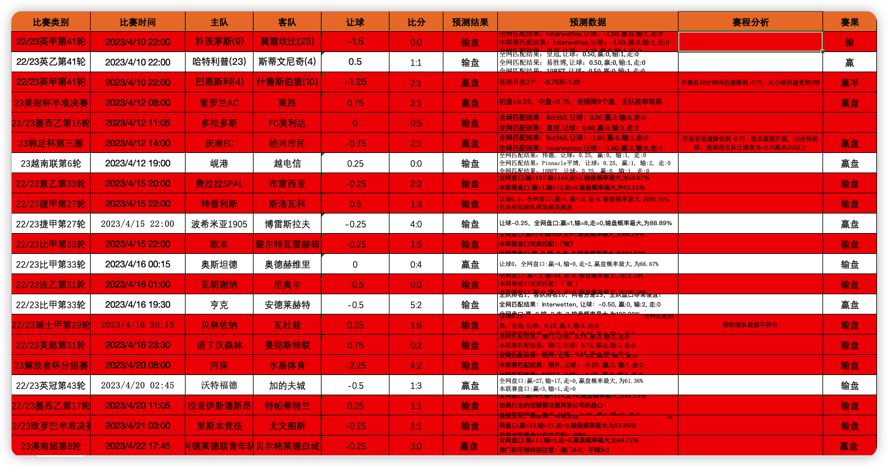
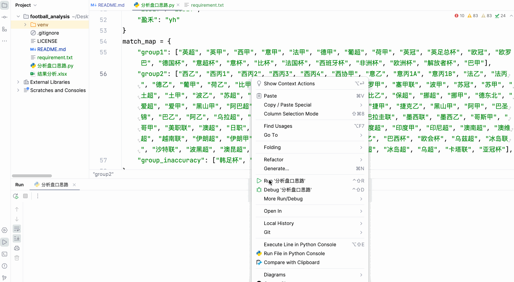

# football_analysis
开源一个自己写的竞彩足彩预测代码，通过大数据匹配亚盘历史相同赔率相同水位的比赛，来得出赢盘或者输盘的结果。目前持续测试中。  

# 目前测试超过200场比赛，准确率80%以上。不需要你懂足球，只要你知道庄家的想法就行，虽然庄家也有看错的时候，但是庄家的判断毕竟比我们准确很多。  

#### 项目运行

* 1.安装python运行环境
自行百度，按教程按照，安装后命令行输入`python3 --version`，有显示版本号即安装成功
* 2.安装依赖包 
命令行进入项目目录下执行`pip install --upgrade -r requirement.txt -i https://mirrors.bfsu.edu.cn/pypi/web/simple`
* 3.直接运行分析盘口思路.py文件即可 
`python3 分析盘口思路.py`
推荐使用pycharm运行，效果比较好

#### 待优化问题

1. 需要将match_map变量的分组精确，把胜率高的联赛分到一组，胜率低的联赛分到一组，以此来提升胜率。
2. 需要优化赔率计算算法，各位有思路可以提出。或者直接提交pr

#### 部分战绩截图

#### 运行截图

#### 问题解决

* 无法克隆仓库，命令改为`git clone ssh://git@ssh.github.com:443/czl0325/football_analysis.git`
